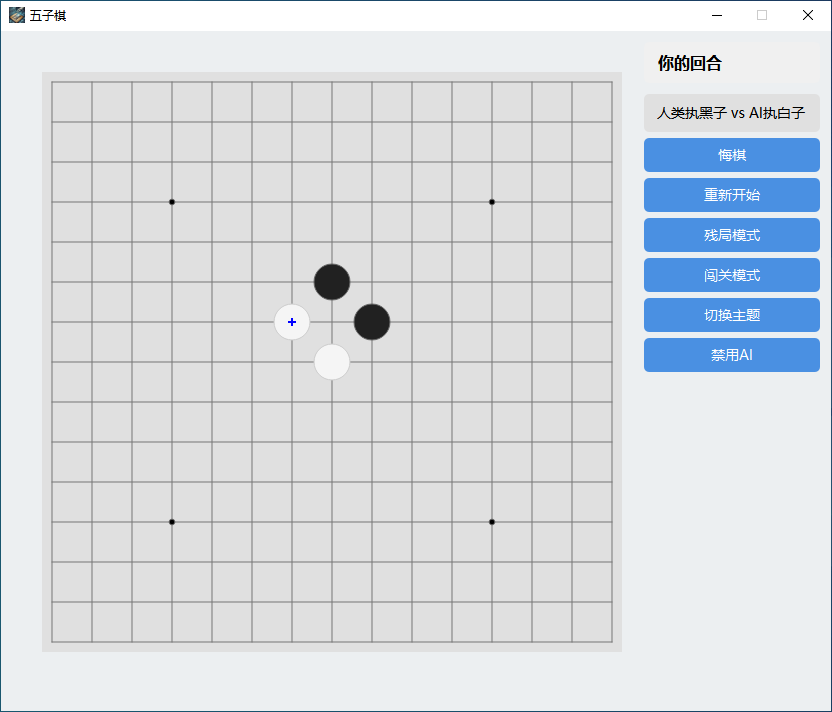

# 🎮 GeminiGo-X

<div align="center">


[](https://www.python.org/downloads/)
[](LICENSE)
[](https://pypi.org/project/PyQt6/)
[](https://deepmind.google/technologies/gemini/)

*基于 Google Gemini 大语言模型的智能五子棋* 🎯

[English](README_EN.md) | 简体中文

</div>

## 🌟 项目介绍

GeminiGo-X 是一款融合了传统五子棋和现代人工智能的游戏。它使用 Google 最新的 Gemini 大语言模型作为 AI 对手，为玩家提供智能、富有挑战性的对弈体验。

## ✨ 核心特性

- 🤖 **智能对弈**
  - 集成 Google Gemini 大语言模型
  - 智能落子策略
  - 实时响应玩家
  - 自动切换备用算法

- 🎨 **精美界面**
  - 现代化 UI 设计
  - 经典/现代双主题
  - 流畅的动画效果
  - 清晰的游戏状态

- 🎯 **丰富玩法**
  - 人机对战模式
  - 双人对战模式
  - 残局练习模式
  - 闯关挑战模式

- 🛠️ **实用功能**
  - 一键悔棋
  - 实时提示
  - 主题切换
  - 游戏状态保存

## 🖼️ 游戏预览



## 🚀 开始使用

### 环境要求

- Python 3.9+
- Google Gemini API 密钥
- 稳定的网络连接

### 快速安装

```bash
# 克隆项目
git clone https://github.com/zh4men9/GeminiGo-X.git
cd GeminiGo-X

# 创建虚拟环境
python -m venv venv
source venv/bin/activate  # Linux/Mac
# 或
venv\Scripts\activate     # Windows

# 安装依赖
pip install -r requirements.txt
```

### 启动游戏

```bash
python main.py
```

## 🎮 游戏指南

### 基础操作

- **开始游戏**: 运行后默认进入双人模式
- **AI 对战**: 点击"启用 AI"并输入 API 密钥
- **落子**: 鼠标点击棋盘交叉点
- **悔棋**: 点击"悔棋"按钮撤销上一步
- **重开**: 点击"重新开始"清空棋盘

### 游戏模式

1. **人机对战**
   - 玩家执黑先手
   - AI 智能应对
   - 支持悔棋和提示

2. **双人对战**
   - 黑白轮流落子
   - 实时显示回合
   - 自动判定胜负

3. **残局练习**
   - 典型残局
   - 提升技巧
   - 即时反馈

## 💡 开发计划

- [ ] 游戏音效系统
- [ ] 对局录像回放
- [ ] 在线对战功能
- [ ] 排行榜系统
- [ ] AI 难度调节
- [ ] 更多主题样式

## 🤝 参与贡献

1. Fork 本仓库
2. 创建新分支: `git checkout -b feature/YourFeature`
3. 提交更改: `git commit -m 'Add YourFeature'`
4. 推送分支: `git push origin feature/YourFeature`
5. 提交 Pull Request

## 📄 开源协议

本项目采用 MIT 协议开源，查看 [LICENSE](LICENSE) 了解更多信息。

## 🙏 致谢

- [Google Gemini](https://deepmind.google/technologies/gemini/)
- [PyQt6](https://www.riverbankcomputing.com/software/pyqt/)
- [NumPy](https://numpy.org/)

## 📧 联系我们

- 作者：zh4men9
- 邮箱：zh4men9@163.com
- 项目：[https://github.com/zh4men9/GeminiGo-X](https://github.com/zh4men9/GeminiGo-X)

---

<div align="center">

**喜欢这个项目？请给它一个 ⭐️ Star！**

</div> 