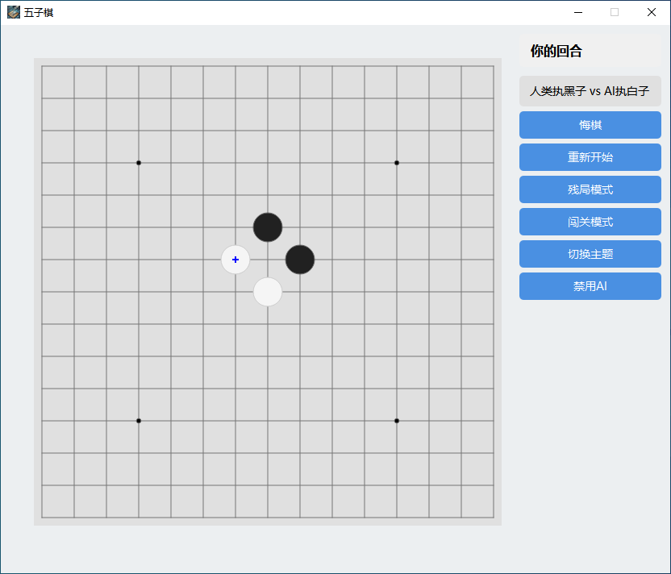

# 🎮 GeminiGo-X

<div align="center">


[](https://www.python.org/downloads/)
[](LICENSE)
[](https://pypi.org/project/PyQt6/)
[](https://deepmind.google/technologies/gemini/)

*An Intelligent Gomoku Game Powered by Google Gemini LLM* 🎯

English | [简体中文](README.md)

</div>

## 🌟 Introduction

GeminiGo-X is an innovative Gomoku (Five in a Row) game that combines traditional gameplay with modern artificial intelligence. Powered by Google's latest Gemini Large Language Model, it offers players an intelligent and challenging gaming experience.

## ✨ Key Features

- 🤖 **Intelligent Gameplay**
  - Google Gemini LLM Integration
  - Smart Move Strategy
  - Real-time Response
  - Automatic Fallback Algorithm

- 🎨 **Elegant Interface**
  - Modern UI Design
  - Classic/Modern Dual Themes
  - Smooth Animations
  - Clear Game Status

- 🎯 **Rich Game Modes**
  - AI vs Human Mode
  - Player vs Player Mode
  - Endgame Practice Mode
  - Challenge Mode

- 🛠️ **Practical Features**
  - One-click Undo
  - Real-time Hints
  - Theme Switching
  - Game State Saving

## 🖼️ Game Preview



## 🚀 Getting Started

### Prerequisites

- Python 3.9+
- Google Gemini API Key
- Stable Internet Connection

### Quick Installation

```bash
# Clone the repository
git clone https://github.com/zh4men9/GeminiGo-X.git
cd GeminiGo-X

# Create virtual environment
python -m venv venv
source venv/bin/activate  # Linux/Mac
# or
venv\Scripts\activate     # Windows

# Install dependencies
pip install -r requirements.txt
```

### Launch Game

```bash
python main.py
```

## 🎮 Game Guide

### Basic Operations

- **Start Game**: Default PvP mode on launch
- **AI Mode**: Click "Enable AI" and enter API key
- **Place Stone**: Click board intersections
- **Undo**: Click "Undo" to reverse last move
- **Restart**: Click "Restart" to clear board

### Game Modes

1. **AI vs Human**
   - Player plays black (first)
   - Intelligent AI responses
   - Undo and hints supported

2. **Player vs Player**
   - Alternating turns
   - Real-time turn display
   - Automatic win detection

3. **Endgame Practice**
   - Classic scenarios
   - Skill improvement
   - Instant feedback

## 💡 Development Roadmap

- [ ] Sound Effects System
- [ ] Game Replay Feature
- [ ] Online Multiplayer
- [ ] Leaderboard System
- [ ] AI Difficulty Levels
- [ ] Additional Themes

## 🤝 Contributing

1. Fork the repository
2. Create feature branch: `git checkout -b feature/YourFeature`
3. Commit changes: `git commit -m 'Add YourFeature'`
4. Push branch: `git push origin feature/YourFeature`
5. Submit Pull Request

## 📄 License

This project is licensed under the MIT License - see the [LICENSE](LICENSE) file for details.

## 🙏 Acknowledgments

- [Google Gemini](https://deepmind.google/technologies/gemini/)
- [PyQt6](https://www.riverbankcomputing.com/software/pyqt/)
- [NumPy](https://numpy.org/)

## 📧 Contact

- Author: zh4men9
- Email: zh4men9@163.com
- Project: [https://github.com/zh4men9/GeminiGo-X](https://github.com/zh4men9/GeminiGo-X)

---

<div align="center">

**Love this project? Give it a ⭐️ Star!**

</div> 